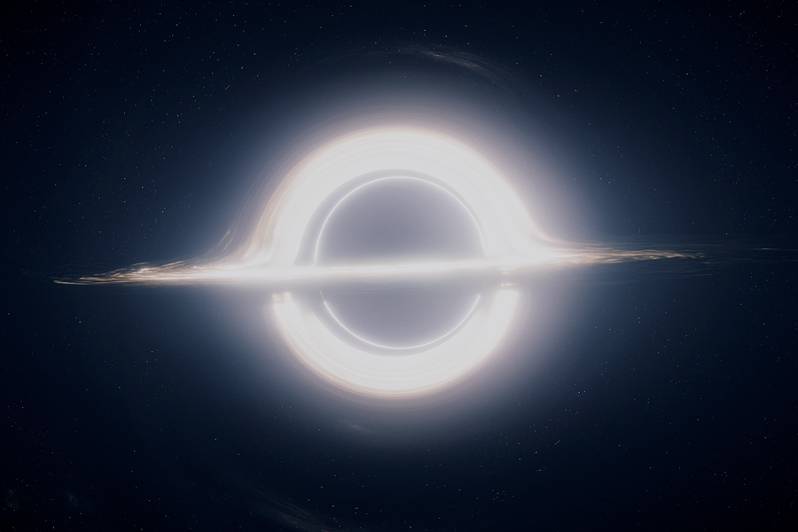
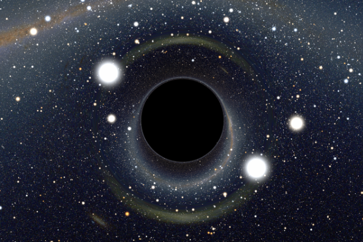
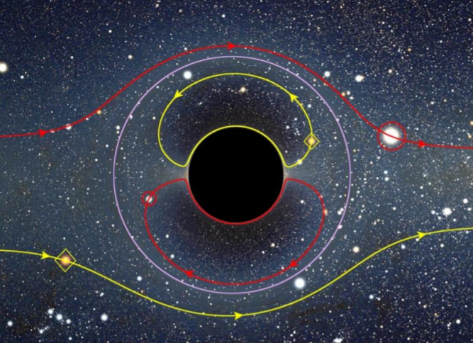
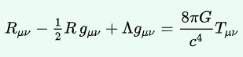
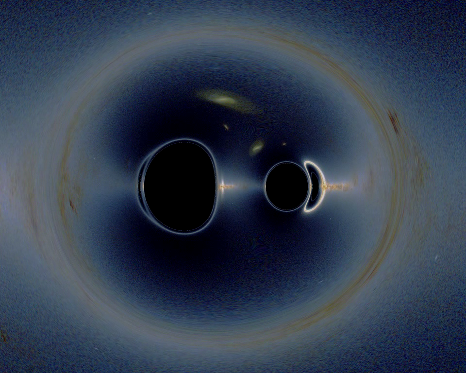
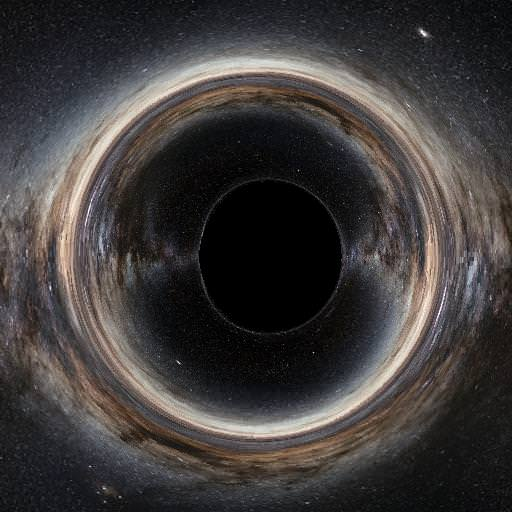
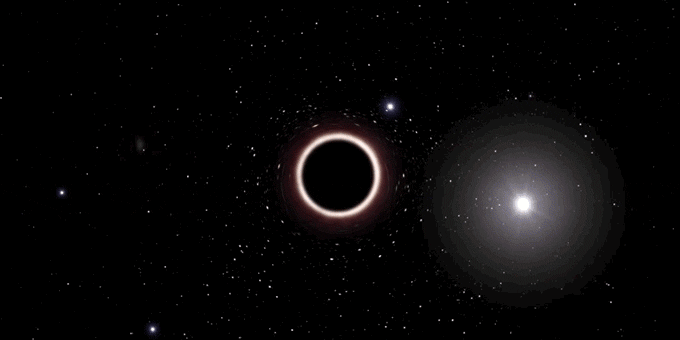

# CS 184 Final Project Proposal: Relativistic Ray Tracer

## Team Members

- Andrew Aikawa 24471725
- Weylan Wang 3032093819
- Yuan Zhou 3032707381

## Overview

For our final project, we are going to implement relativistic ray tracing. In Einstein's theory of general relativity, physical phenomena occur in 4-dimensional spacetime. In particular, light travels along the 4-dimensional analog of lines in 3-dimensional Euclidean space known as geodesics. This presents a number of interesting problems, since now, light in a scene does not necessarily travel in a straight line and will bend in the presence of black holes or intense gravity, because the local space time metric changes with respect to spacetime. Our goal is to be able to realistically render scenes such as a star field under the effect of the gravitational lensing of light.

Light bending around a black hole in the movie Interstellar

A star field under the effect of a black hole (A. Riazuelo, IAP/UPMC/CNRS)

## Problem Description

In the presence of black holes, light bends from its normally straight trajectory in a phenomenon known as gravitational lensing. As a result, a light ray can no longer take a linear parameterization as we did in Project 3 since the path taken by a ray is a generic curve determined by the nature of the black hole. In general, tracing a light ray as a curve that interacts with a gravitational field will require a numerical integration technique (i.e. Euler's method) to faithfully reconstruct the ray path, which is computationally expensive if we are considering the numerous light sources in a star field. The problem is further complicated by the fact that the metric (how we measure distance in 4-dimensional spacetime), which determines what curves light travels on, depends on where we are in space and is unique to the system under consideration (the masses involved) by means of the nonlinear Einstein field equations. In a generalized problem, the metric must also be solved numerically. The nonlinearity of the Einstein equation's and of light rays changes the entire paradigm of raytracing and will the be the source of difficulty in this project.

Gravity lensing in action, with stars and their ghost images reflected inside the Einstein ring

Einstein's field equations

## Goals and Deliverables

By the end of this project, we hope to render a few short movies of either the camera orbiting a black hole or the black hole moving with respect to the camera in order to capture some of the relativistic dynamics. There's room for more complicated images within the framework of this project that is of interest in modern cosmology, such as what it would look like to have a black hole with differing mass, spin/charge, multiple black holes, and etc. With respect to performance, we can try different numerical integration techniques and compare speedup and performance trade-offs between them if we have time.

Two black holes, with the larger to the left and the smaller to the right

To get started, we will first consider the simplest systems, which is a single black hole. This family of systems in particular are much simpler than the generalized case since there exist exact, analytical metrics in these cases. The simplest of these is a Schwarzchild black hole, which has zero charge and zero spin, which possesses a Schwarzchild metric. Our first renders will be of this system to ensure that our ray tracer will at least work with this system. If we can get this to work, we will move onto other systems with exactly solvable metrics, such as the Kerr metric, the solution for a black hole with no charge, but nonzero spin. If our ray tracer faithfully renders single frames in these cases, we will make short movies with these 2 systems, varying the relevant parameters in these systems, namely mass and spin.

The Milky Way, distorted by a Kerr black hole

An example of the type of short movie we aim to render

If we can get the previous parts working, we will explore systems that require numerical metrics (i.e. binary black hole systems) and capture videos of these. Beyond this, we can add some effects to make the black hole appear more realistic, such as an accretion disk, a thin field of matter that orbits a black hole as a result of the gravity of the black hole, as well as Doppler shift, the change in the spectrum of incoming light as a result of time dilation from the black hole.

## Schedule

- Week 1: Have single frame renders for Schwarzchild and Kerr black holes
- Week 2: Produce a short movie of a moving Schwarzchild Black Hole
- Week 3: Compare movies of different Schwarzchild and Kerr black holes of varying parameters
- Week 4: Have a movie of a system using a numerical metric

By this point it will be the milestone report. We hope that in between this time and the final project due date to be rendering high resolution videos of a lot of different numerical metric systems.

## Resources

Fortunately, for us, this problem has been approached many times in academic papers and most prominently in the movie [Interstellar](https://arxiv.org/pdf/1502.03808.pdf). The Interstellar publication goes into detail the algorithm used to produce their images, but lacks the source code. The Interstellar publication also references other previous work such as [this](http://www2.iap.fr/users/riazuelo/interstellar/index.php), upon which we can also compare results. One of the more promising resources we have come across is a [ray tracer](https://arxiv.org/pdf/1109.4769.pdf) written in C++ built to handle numerical metrics, but also allows us to add our own plug ins, such as custom numerical integrators.

For computing platforms, we will perform our renders at the [OCF](https://ocf.io/) and on our personal computers.
