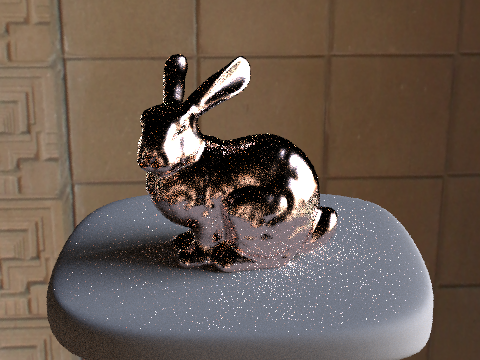

# Assignment 3-2: PathTracer 2

###### Yuan Zhou

## Overview

In this project, I implemented the [BSDF](https://en.wikipedia.org/wiki/Bidirectional_scattering_distribution_function) for mirror, glass, and generic microfacet material, so the ray tracer can render these materials. I also implemented environment light so the background of the render is no longer infinite dark, and the object can be lit up according to the environment. Last but not least, I implemented thin lens rendering, so the ray tracer can simulate the effect of depth of field of a real life camera.

## Part 1: Mirror and Glass Materials

Mirror and glass are perfect reflection and refraction models, and they themselves do not have color. The way we implement the BSDFs for these materials is to purely calculate where the incoming light is given the out going light. For mirror, we just do a perfect specular reflection on the surface against the surface normal. For glass, some fraction of the light gets reflected and some gets refracted. We use the [Schlick's approximation](https://en.wikipedia.org/wiki/Schlick%27s_approximation) to approximate this phenomenon: for each ray, we calculate the probability that it'll reflect, and flip a coin to decide whether to reflect or refract the light. Refraction is done by applying [Snell's law](https://en.wikipedia.org/wiki/Snell%27s_law) on the surface. We need to handle the case when light is coming into the material and out of the material separately, because the coefficient is inverted, and the `z` coordinate is negated.

Here are some renderings of a mirror sphere and a glass sphere, with 4096 rays/pixel, 64 light rays, and different max ray depths:

- 0 max ray depth: we can only see the light source.  
    
- 1 max ray depth: this is just direct lighting. Because the mirror and the glass don't have color, they appear dark in the scene.  
    
- 2 max ray depth: now we can see the scene rendered by 1 max ray depth reflected in the mirror and the glass. The refracted light has traveled into the glass, but hasn't traveled out, so the glass still appears dark.  
    
- 3 max ray depth: the scene rendered by 2 max ray depth is reflected in the mirror. Now we can see the things behind the glass because the light has traveled out of the glass.  
    
- 4 max ray depth: the scene rendered by 3 max ray depth is reflected in the mirror. On the ground appears a bright area. This is the effect of the glass sphere converging light to the ground.  
    
- 5 max ray depth: the scene rendered by 4 max ray depth is reflected in the mirror. We can see a bright spot on the right wall. This is the light coming from the light source, reflected by the mirror, and converged by the glass sphere to the wall.  
    
- 100 max ray depth: now we have a brighter top of the glass sphere and a brighter ceiling. This is the light converged on the ground reflect back through the glass sphere to the ceiling.  
    

## Part 2: Microfacet Material

To model the surface of isotropic rough conductors, we can use microfacet. It consists of the Fresnel term, a shadowing-masking term, and the normal distribution function. By calculating them using the properties of the material (the roughness of the macro surface, the refractive index, and the extinction coefficient), we can get realistic renderings of the material.

Here are some renderings of a dragon made of gold, with 4096 rays/pixel, 64 light rays, 100 max ray depth, and different roughness:

- A roughness of 0.005: the gold looks like a golden mirror, because the surface is too smooth.  
    
- A roughness of 0.05: the gold is less reflective.  
    
- A roughness of 0.25: the gold is even less reflective.  
    
- A roughness of 0.5: without specular reflection, this image resembles a real piece of gold.  
    

As in light sampling, we can do both uniform hemisphere sampling and importance sampling on a microfacet surface. We can try to make our [PDF](https://en.wikipedia.org/wiki/Probability_density_function) resemble the normal distribution function using the importance sampling, so we get a smaller variance over fewer samples.

This is an example of uniform hemisphere sampling, with 64 rays/pixel, 1 light ray, and 100 max ray depth:

This is an example of importance sampling, with 64 rays/pixel, 1 light ray, and 100 max ray depth:

We can see that, under the same parameters, importance sampling produces less noise than uniform hemisphere sampling.

By altering the roughness of the macro surface, the refractive index, and the extinction coefficient, we can render different kinds of materials without changing anything else. Here is the same dragon shown above, but made of titanium, based on the data [here](https://refractiveindex.info/?shelf=main&book=Ti&page=Johnson):

## Part 3: Environment Light

Up until now, our renderings have a dark background. This is not good if we want to simulate an object in a real world. With environment light, we can put our object in an environment, and render the object according to the lighting level of the environment map.

There are a few modifications made to the ray tracer. If a camera ray doesn't intersect any primitives in the scene, we'll now sample that pixel from the environment map. The environment map itself also acts like a light source infinitely far away. So other objects can reflect light from the environment.

This is the environment map we'll be using in the demonstration:

Not surprisingly, the environment map can also be sampled from using importance sampling. We can calculate the brightness of each pixel in the environment map, and make a [CDF](https://en.m.wikipedia.org/wiki/Cumulative_distribution_function) of each row, and each column conditioning on the row, so we can sample the pixel according to the brightness of the environment map. Here is the CDF of the environment map we are using:

This is a bunny rendered using uniform hemisphere sampling, with 4 rays/pixel, 64 light rays, and 100 max ray depth:

This is the same bunny rendered using importance sampling; we can see that the noise is greatly reduced under the same parameters:

This is a copper bunny rendered using uniform hemisphere sampling, with 4 rays/pixel, 64 light rays, and 100 max ray depth:

This is the same bunny rendered using importance sampling; we can see that the noise is somewhat reduced under the same parameters:

## Part 4: Depth of Field

The camera model we've been using by now is the pinhole camera model, which can focus on anything regardless of the distance to that object. But cameras in real life typically uses lenses to focus on a particular depth. By simulate a refractive thin lens in front of the camera, we can get a cool out of focus effect when rendering scenes.

Here is a stack of renderings with the same aperture size, but differing focus depths, with 256 rays/pixel, 4 light rays, and 8 max ray depth:

Here is a stack of renderings with differing aperture sizes, but the same focus depth, with 256 rays/pixel, 4 light rays, and 8 max ray depth:

AMAZING, RIGHT?
